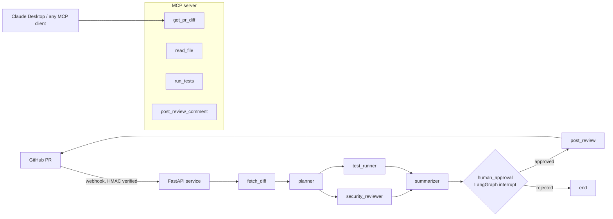

# MCP Code Review Agent

A multi-agent pull request reviewer built on **Claude tool calling**, **LangGraph** and a custom
**Model Context Protocol (MCP) server**. It reads a pull request, finds bugs and security issues,
waits for a human to approve the review, then posts inline comments on GitHub.

It ships with a **30-case evaluation suite** of pull-request diffs with seeded bugs, so changes to
prompts or models are measured, not guessed.



## What's inside

| Piece | What it does |
|---|---|
| `mcp_server.py` | MCP server (Python MCP SDK) exposing `get_pr_diff`, `read_file`, `run_tests`, `post_review_comment`. Works over stdio (Claude Desktop) or streamable HTTP. |
| `graph.py` | LangGraph workflow: planner → security reviewer and test runner **in parallel** → summarizer → human approval → post. Shared typed state with reducers, retry policy with backoff on LLM nodes. |
| `llm.py` | A small, explicit Claude tool-calling loop. Each agent gets tools plus a `submit_result` tool whose schema is a Pydantic model, so every agent returns validated, typed output. Invalid output is sent back to Claude to fix. Tracks tokens per call. |
| `server.py` | FastAPI webhook service. Verifies GitHub signatures (HMAC-SHA256), runs reviews in the background, checkpoints graph state to SQLite, and exposes admin endpoints to approve, edit or reject a review. |
| `evals/` | 30 seeded-bug PR diffs across security, correctness, concurrency, reliability and performance, plus a runner reporting detection rate, false-positive rate, tokens, cost and p50/p95 latency. |
| `.github/workflows/ci.yml` | Lint + 23 unit tests on every push; Docker build; the full eval suite against the real Claude API on every push to `main`. |
| `docs/deploy-aws.md` | Deploying on AWS EC2 with Docker and Caddy (HTTPS). |

## Quick start

```bash
git clone https://github.com/vkxr/mcp-code-review-agent.git && cd mcp-code-review-agent
python -m venv .venv && source .venv/bin/activate
pip install -e ".[dev]"
cp .env.example .env   # add ANTHROPIC_API_KEY and GITHUB_TOKEN
export $(grep -v '^#' .env | xargs)

pytest -q                                   # 23 tests, no API key needed

review-agent review owner/repo#42           # review a PR; asks before posting
review-agent review --diff my.diff          # review a local diff, print only
```

## Use the tools from Claude Desktop

Add to `claude_desktop_config.json`:

```json
{
  "mcpServers": {
    "code-review": {
      "command": "/path/to/.venv/bin/review-agent-mcp",
      "env": { "GITHUB_TOKEN": "ghp_..." }
    }
  }
}
```

Then ask Claude: *"Get the diff for vkxr/demo PR 3 and point out any security issues."*

## Evaluation

```bash
python -m evals.run_eval                                   # all 30 cases
python -m evals.run_eval --model claude-haiku-4-5-20251001 --limit 10
```

Each case is a realistic change that adds working code plus one planted bug (SQL injection,
unverified JWTs, missing authorization, off-by-one pagination, TOCTOU races, swallowed payment errors,
N+1 queries, and more). A bug counts as detected when a posted comment lands on the right file within
two lines of the bug. Every other comment counts as a false positive, so the metric rewards precision,
not volume.

Results are written to `evals/results/` as JSON and Markdown.

<!-- Paste your latest results table here after running the eval. -->

## Design decisions

- **Why a hand-written tool loop instead of a prebuilt agent?** It keeps control visible: forced tool
  use (`tool_choice: any`), schema-validated outputs, errors returned to the model, exact token
  accounting per node. It's ~100 lines and easy to test with a scripted fake client.
- **Numbered diffs.** LLMs miscount lines inside hunks. Each diff line is prefixed with its new-file
  line number, which makes inline comments land on the right line.
- **Human in the loop by default.** The graph pauses with `interrupt()` before anything is posted.
  State is checkpointed, so a review can wait hours for approval and survive a restart.
- **Inline vs. body comments.** GitHub rejects inline comments outside diff hunks, so those findings
  move into the review body instead of failing the whole post.
- **Untrusted code.** Running a PR's tests executes its code. The test runner only runs inside
  `REVIEW_WORKDIR`, is off by default in the server, and the service runs as a non-root user in Docker.

## Project layout

```
src/review_agent/
  mcp_server.py   MCP server
  graph.py        LangGraph multi-agent workflow
  llm.py          Claude tool-calling loop, usage and cost tracking
  schemas.py      Pydantic output models
  workspace.py    GitHub and local workspaces
  diff.py         unified diff parsing and line numbering
  tools.py        sandboxed test runner
  server.py       FastAPI webhook + approval API
  cli.py          command line interface
evals/            seeded-bug cases and eval runner
tests/            unit tests (fake Claude client, no network)
```

## License

MIT
